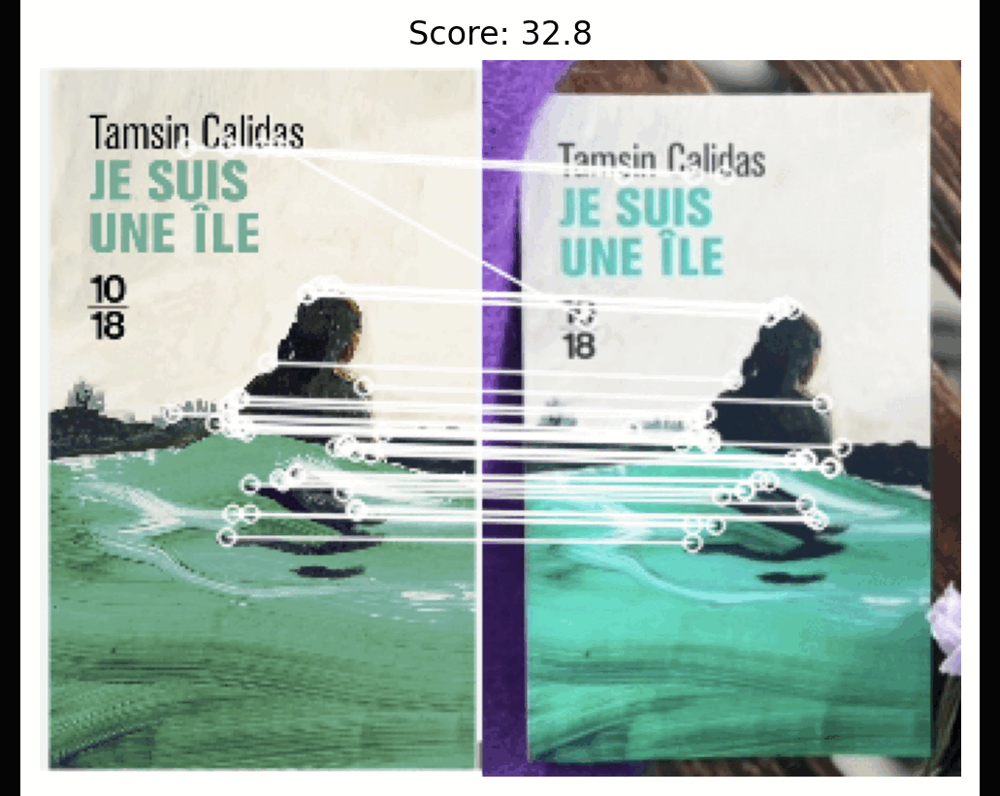

# Fast Image Similarity



## Introduction
This code allows you to calculate a similarity score between images. The algorithm can be used in projects where you need to find similar images from a collection of images. It works well on images containing the same objects, such as grocery goods or product labels.

The algorithm is based on the ORB Keypoint Detector in OpenCV. For matching keypoints obtained by the detector, the Brute-Force matcher with knnMatch is used along with a ratio test to filter out good matches. By considering the number of good matches and the number of keypoints in a pair of images, it is possible to calculate a similarity score.

$$Similarity\ Score = \frac{N\ matched\ keypoints}{\max(N\ keypoints_{first\ image} , N\ keypoints_{second\ image})}$$

where $N$ stands for number.

## Required Packages
- python 
- opencv
- jupyter (optional: to run jupyter notebook)
- matplotlib (optional: to plot results in the notebook)

## Usage
Here's a quick example of how to use the code:
```python
from utils import calculate_similarity

image1 = 'path_to_image1.jpg'
image2 = 'path_to_image2.jpg'

score = calculate_similarity(image1, image2, show_plot=True)
```

## Examples
Examples of calculating similarity scores can be found in `example.ipynb`

## Performance

I provide results of some experiments to show that the ORB feature detector can be optimized in terms of time consumption.. It can be important in real-time products. 

As you can see, the matching time between two images rapidly decreases with the number of keypoints detected by ORB. For example, if you want to compare 10,000 image pairs, you can save a significant amount of time (2.7 s for the ORB detector with 150 keypoints vs. 10.3 s for the default ORB detector with 500 keypoints). 

|                                                          | Extracting Time, ms | Average Number of Detected Keypoints per Image | Matching Time Between Two Images, ms |
| -------------------------------------------------------- | ------------------- | ---------------------------------------------- | ------------------------------------ |
| ORB detector nfeatures=150<br>image size = 256           | 1.36                | 135                                            | 0.27                                 |
| ORB detector nfeatures=300<br>image size = 256           | 1.45                | 256                                            | 0.61                                 |
| ORB detector default (nfeatures=500)<br>image size = 256 | 1.77                | 408                                            | 1.03                                 |
| ORB detector nfeatures=600<br>image size = 256           | 1.63                | 478                                            | 1.37                                 |
|                                                          |                     |                                                |                                      |
| ORB detector nfeatures=150<br>image size = 256           | 1.36                | 135                                            | 0.27                                 |
| ORB detector nfeatures=150<br>image size = 350           | 2.36                | 147                                            | 0.30                                 |
| ORB detector nfeatures=150<br>image size = 500           | 3.91                | 150                                            | 0.32                                 |